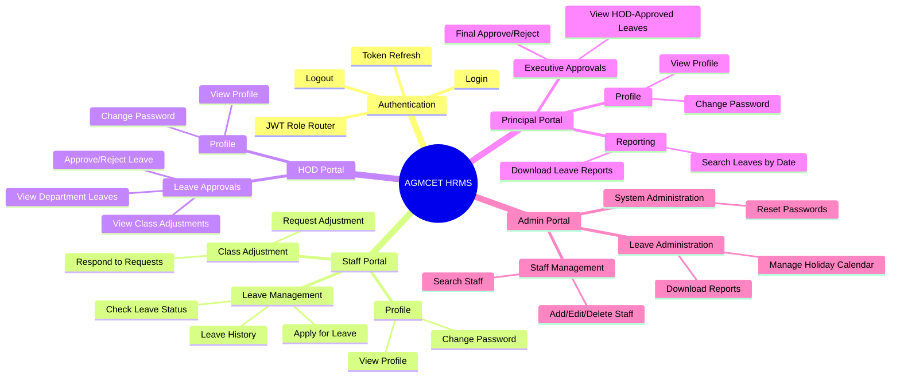
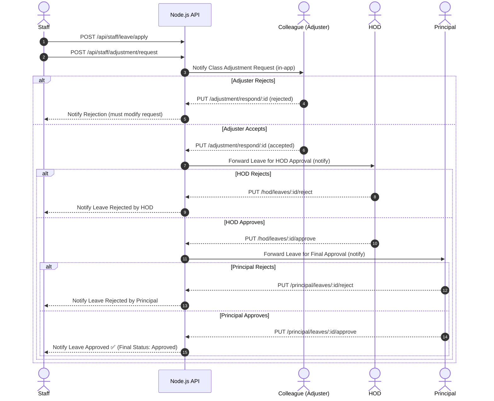

# AGMCET HRMS — Project Wireframe & User Flow

**Client:** A.G.M College of Engineering & Technology  
**Project:** Human Resource Management System (HRMS)  
**Tech Stack:** React (Frontend) · Node.js + Express (Backend API) · MySQL (Database)  
**Architecture:** REST API · Role-Based Access Control (RBAC) · JWT Authentication  
**Theme:** Premium · Professional · Modern

---

## 1. System Architecture & Role Map

The system uses a Role-Based Access Control (RBAC) mechanism with four primary user roles: **Admin**, **Principal**, **HOD (Head of Department)**, and **Staff**.



---

## 2. Tech Stack Breakdown

### Frontend — React
| Layer | Technology |
|---|---|
| Framework | React 18 + Vite |
| Routing | React Router v6 |
| State Management | Zustand / Context API |
| UI Components | Shadcn/UI + Tailwind CSS |
| HTTP Client | Axios |
| Auth | JWT stored in httpOnly cookies |
| Charts/Reports | Recharts |
| Export | xlsx / file-saver |

### Backend — Node.js
| Layer | Technology |
|---|---|
| Runtime | Node.js |
| Framework | Express.js |
| Auth | JWT (jsonwebtoken) + bcrypt |
| ORM/Query | mysql2 / Sequelize |
| Validation | Zod / Joi |
| File Export | exceljs |
| Middleware | Role guard, Auth guard, Error handler |

### Database — MySQL
| Table | Purpose |
|---|---|
| `users` | All staff, HOD, Principal, Admin accounts |
| `leaves` | Leave applications with full status trail |
| `class_adjustments` | Class adjustment requests and responses |
| `departments` | Department master data |
| `holiday_calendar` | Managed dates / term dates |
| `notifications` | In-app notification log |

---

## 3. API Route Architecture

### Auth Routes — `/api/auth/`
| Method | Route | Description |
|---|---|---|
| POST | `/login` | Validate credentials, return JWT |
| POST | `/logout` | Clear token/session |
| POST | `/refresh` | Refresh JWT token |
| PUT | `/change-password` | Change own password |

### Staff Routes — `/api/staff/`
| Method | Route | Description |
|---|---|---|
| POST | `/leave/apply` | Submit new leave application |
| GET | `/leave/status` | Get status of own leaves |
| GET | `/leave/history` | Get year-wise leave history |
| POST | `/adjustment/request` | Request class adjustment from colleague |
| PUT | `/adjustment/respond/:id` | Accept or reject adjustment request |
| GET | `/adjustment/incoming` | View incoming adjustment requests |

### HOD Routes — `/api/hod/`
| Method | Route | Description |
|---|---|---|
| GET | `/leaves/pending` | Get department leaves pending HOD approval |
| GET | `/leaves/:id/adjustment` | Check if class adjustment is confirmed |
| PUT | `/leaves/:id/approve` | Approve leave |
| PUT | `/leaves/:id/reject` | Reject leave with reason |

### Principal Routes — `/api/principal/`
| Method | Route | Description |
|---|---|---|
| GET | `/leaves/pending` | Get HOD-approved leaves for final approval |
| PUT | `/leaves/:id/approve` | Final approve leave |
| PUT | `/leaves/:id/reject` | Final reject leave with reason |
| GET | `/reports/search` | Search leaves by date range |
| GET | `/reports/download` | Export leave report as Excel |

### Admin Routes — `/api/admin/`
| Method | Route | Description |
|---|---|---|
| GET | `/staff` | List all staff |
| POST | `/staff` | Add new staff member |
| PUT | `/staff/:id` | Edit staff details |
| DELETE | `/staff/:id` | Delete staff record |
| POST | `/calendar/date` | Insert holiday/term date |
| GET | `/calendar/check` | Validate date availability |
| GET | `/reports/download` | Institution-wide report export |
| PUT | `/reset/staff/:id` | Reset staff password |
| PUT | `/reset/hod/:id` | Reset HOD password |

---

## 4. Core Workflow: Leave Application & Class Adjustment

The primary and most complex workflow — **Leave Application with Class Adjustment**.



---

## 5. React Frontend — Page-by-Page Breakdown

### 🚪 Auth Pages (`/`)
- **`/login`** — Institutional login page with AGMCET logo, role selector dropdown (Staff / HOD / Principal / Admin), username, password fields, and "Forgot Password" link. JWT stored on success, user routed to role-based dashboard.

---

### 👤 Staff Dashboard (`/staff/`)
> *Daily portal for teaching and non-teaching staff.*

| Route | Component | Purpose |
|---|---|---|
| `/staff/dashboard` | `StaffHome` | Overview: leave balance, pending adjustments, notifications |
| `/staff/leave/apply` | `LeaveForm` | Multi-step leave application wizard |
| `/staff/leave/status` | `LeaveStatus` | Track all leave applications with status badges |
| `/staff/leave/history` | `LeaveHistory` | Year-wise leave history with filters |
| `/staff/adjustment/request` | `AdjustmentForm` | Request colleague to cover class |
| `/staff/adjustment/respond` | `AdjustmentRespond` | Accept/reject incoming adjustment requests |
| `/staff/profile` | `StaffProfile` | View profile, change password |

---

### 👔 HOD Dashboard (`/hod/`)
> *Departmental oversight and first-level leave approval.*

| Route | Component | Purpose |
|---|---|---|
| `/hod/dashboard` | `HODHome` | Overview: pending leaves count, dept stats |
| `/hod/leaves` | `HODLeaveList` | All department leaves pending HOD approval |
| `/hod/leaves/:id` | `HODLeaveDetail` | Detailed leave view with class adjustment confirmation |
| `/hod/leaves/:id/confirm` | `HODLeaveConfirm` | Approve or reject with remarks |
| `/hod/profile` | `HODProfile` | View profile, change password |

---

### 🏛️ Principal Dashboard (`/principal/`)
> *Executive oversight and final leave approval.*

| Route | Component | Purpose |
|---|---|---|
| `/principal/dashboard` | `PrincipalHome` | Overview: pending final approvals, institution stats |
| `/principal/leaves` | `PrincipalLeaveList` | HOD-approved leaves pending final approval |
| `/principal/leaves/:id/confirm` | `PrincipalLeaveConfirm` | Final approve or reject |
| `/principal/reports` | `LeaveReports` | Search leaves by date range across institution |
| `/principal/reports/download` | — | Trigger Excel export |
| `/principal/profile` | `PrincipalProfile` | View profile, change password |

---

### ⚙️ Admin Dashboard (`/admin/`)
> *System maintenance and HR data management.*

| Route | Component | Purpose |
|---|---|---|
| `/admin/dashboard` | `AdminHome` | Overview: total staff, leave stats, system health |
| `/admin/staff` | `StaffList` | View, search all staff |
| `/admin/staff/add` | `AddStaff` | Add new staff member |
| `/admin/staff/edit/:id` | `EditStaff` | Edit existing staff record |
| `/admin/staff/delete/:id` | — | Confirm and delete staff |
| `/admin/calendar` | `CalendarManager` | Manage holiday calendar and term dates |
| `/admin/reports` | `AdminReports` | Search, filter, download leave reports |
| `/admin/reset/staff` | `ResetStaffPassword` | Reset staff passwords |
| `/admin/reset/hod` | `ResetHODPassword` | Reset HOD passwords |

---

## 6. UI/UX Design Direction — Premium & Professional

### Theme
- **Color Palette:** Deep navy `#0A1628` as primary, gold accent `#C9A84C`, clean white `#FFFFFF` backgrounds for cards
- **Typography:** Inter or Plus Jakarta Sans — clean, modern, legible
- **Tone:** Corporate-grade but not cold. Premium institutional feel.

### Global Layout
```
┌─────────────────────────────────────────────────────────┐
│  AGMCET Logo     [Search]    🔔 Notifications   👤 User │  ← Top Header
├────────────┬────────────────────────────────────────────┤
│            │                                            │
│  Sidebar   │           Main Content Area                │
│            │                                            │
│ • Dashboard│   ┌──────────┐ ┌──────────┐ ┌──────────┐  │
│ • Leaves   │   │  Card 1  │ │  Card 2  │ │  Card 3  │  │
│ • Adjust.  │   └──────────┘ └──────────┘ └──────────┘  │
│ • Reports  │                                            │
│ • Profile  │   ┌──────────────────────────────────────┐ │
│            │   │         Data Table / Form            │ │
│            │   └──────────────────────────────────────┘ │
└────────────┴────────────────────────────────────────────┘
```

### Key UI Components
- **Status Badges:** `Approved` (green), `Pending` (amber), `Rejected` (red), `Forwarded` (blue)
- **Notifications Bell:** Real-time count badge — "3 Pending Approvals", "1 Adjustment Request"
- **Leave Form Wizard (3 Steps):**
  - **Step 1:** Leave Type (Casual / Sick / Academic / Duty) + Date Range picker
  - **Step 2:** Reason / Remarks text area
  - **Step 3 (Conditional):** If working days selected → Class Adjustment flow to pick colleague + period
- **Data Tables:** Sortable, filterable, paginated with export button
- **Dashboard Cards:** Leave balance summary, pending actions count, quick-action buttons

---

## 7. MySQL Database Schema (Core Tables)

```sql
-- Users (all roles in one table, role column differentiates)
CREATE TABLE users (
  id INT PRIMARY KEY AUTO_INCREMENT,
  name VARCHAR(100),
  email VARCHAR(100) UNIQUE,
  password VARCHAR(255),
  role ENUM('staff', 'hod', 'principal', 'admin'),
  department_id INT,
  employee_id VARCHAR(50) UNIQUE,
  created_at TIMESTAMP DEFAULT CURRENT_TIMESTAMP
);

-- Leaves
CREATE TABLE leaves (
  id INT PRIMARY KEY AUTO_INCREMENT,
  user_id INT,
  leave_type ENUM('casual', 'sick', 'academic', 'duty'),
  from_date DATE,
  to_date DATE,
  reason TEXT,
  status ENUM('pending_adjustment', 'pending_hod', 'pending_principal', 'approved', 'rejected'),
  hod_remarks TEXT,
  principal_remarks TEXT,
  applied_at TIMESTAMP DEFAULT CURRENT_TIMESTAMP,
  FOREIGN KEY (user_id) REFERENCES users(id)
);

-- Class Adjustments
CREATE TABLE class_adjustments (
  id INT PRIMARY KEY AUTO_INCREMENT,
  leave_id INT,
  requester_id INT,
  adjuster_id INT,
  period VARCHAR(50),
  subject VARCHAR(100),
  status ENUM('pending', 'accepted', 'rejected'),
  responded_at TIMESTAMP,
  FOREIGN KEY (leave_id) REFERENCES leaves(id)
);

-- Departments
CREATE TABLE departments (
  id INT PRIMARY KEY AUTO_INCREMENT,
  name VARCHAR(100),
  hod_id INT
);

-- Holiday Calendar
CREATE TABLE holiday_calendar (
  id INT PRIMARY KEY AUTO_INCREMENT,
  date DATE UNIQUE,
  description VARCHAR(255),
  type ENUM('holiday', 'term_start', 'term_end')
);

-- Notifications
CREATE TABLE notifications (
  id INT PRIMARY KEY AUTO_INCREMENT,
  user_id INT,
  message TEXT,
  is_read BOOLEAN DEFAULT FALSE,
  created_at TIMESTAMP DEFAULT CURRENT_TIMESTAMP
);
```

---

## 8. Project Folder Structure

```
agmcet-hrms/
├── client/                        # React Frontend
│   ├── src/
│   │   ├── pages/
│   │   │   ├── auth/              # Login page
│   │   │   ├── staff/             # Staff portal pages
│   │   │   ├── hod/               # HOD portal pages
│   │   │   ├── principal/         # Principal portal pages
│   │   │   └── admin/             # Admin portal pages
│   │   ├── components/
│   │   │   ├── ui/                # Reusable UI (badges, cards, tables)
│   │   │   ├── layout/            # Sidebar, Header, Layout wrapper
│   │   │   └── forms/             # LeaveForm, AdjustmentForm, etc.
│   │   ├── hooks/                 # Custom React hooks
│   │   ├── store/                 # Zustand state
│   │   ├── services/              # Axios API calls
│   │   └── utils/                 # Helpers, formatters
│   └── package.json
│
├── server/                        # Node.js + Express Backend
│   ├── src/
│   │   ├── routes/
│   │   │   ├── auth.routes.js
│   │   │   ├── staff.routes.js
│   │   │   ├── hod.routes.js
│   │   │   ├── principal.routes.js
│   │   │   └── admin.routes.js
│   │   ├── controllers/           # Business logic per route
│   │   ├── middleware/
│   │   │   ├── auth.middleware.js  # JWT verification
│   │   │   └── role.middleware.js  # Role guard
│   │   ├── models/                # MySQL query models
│   │   ├── config/
│   │   │   └── db.js              # MySQL connection pool
│   │   └── app.js
│   └── package.json
│
└── README.md
```
